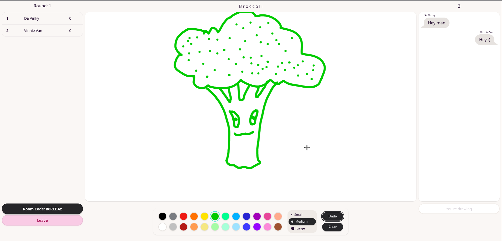

# Tom's Drawing Game

A small real-time drawing-guessing game built as a backend-focused learning project.
Rebuilt in C# to help me learn the language.

The goal for this project was not to build the most feature-rich drawing game possible. I wanted this project to show practical design decisions, appropriate separation of responsibilities between classes, and some WebSocket usage in C#. Of course, it was partly chosen because it sounded fun! It was one of the few web games I could make without being an artist (ironically).

As always, this README was written entirely by myself.



## The Process: Backend Is The Focus

I wanted to keep my focus on the backend during this project, so for the frontend wiring I employed the use of agentic coding. I used a system of planning out a feature and agreeing with the coding agent on the shared contract, then I would implement the backend for that feature independently, and hand over to the agent to wire in the frontend. So each feature was implemented end to end as a vertical slice.

The design, styling decisions, and component structure had already been established by me manually, the coding agent was there to wire these up, and to add new elements when needed. The UI is pretty basic, I will likely keep polishing when I have the time.

I've included [plan.md](./plan.md), which details the workflow I agreed on with the agent. I found it to be a surprisingly enjoyable way to learn and keep within my area of focus. I've included this section high up to make sure that I don't give anyone the wrong impression about what was and wasn't built by myself.

## How It Works

### Minimal Tech Stack

- [ASP.NET Core](https://dotnet.microsoft.com/en-us/apps/aspnet) and [SignalR](https://dotnet.microsoft.com/en-us/apps/aspnet/signalr) for the backend
- [React](https://react.dev/) and [TypeScript](https://www.typescriptlang.org/) for the frontend
- an in-memory room and game-state
- and a background service for the game loop

### Game Flow

- Create a room and invite your friends.
- Start the game and the first artist is chosen.
- The artist chooses a word to draw which is hidden from everyone else.
- Against the clock, the artist will try to draw this word so that the other players can guess it.
- Guessing correctly, or having someone guess your drawing correctly, gives you points.
- All of the players take turns being the artist and the game cycles through a set number of rounds.
- At the end of the game, the winner with the highest score is declared.

## Planned Features

**Game configuration**: I wanted to get this rewrite onto GitHub relatively quickly. So I skipped game settings customisation for the MVP, even though the feature was in the original version.

## Design Decisions

Server has authority over the game-state

- To keep all of the connected clients in a room in sync with each other, we must have a single source of truth.
- The server validates all input before mutating the game state.
- The current word is never broadcast to the group. It is only ever sent privately to the current artist.

Room locks

- We do the Game Manager operations inside of a lock. Each room has it's own lock. This makes sure that two operations can't touch the same mutable state simultaneously, potentially causing inconsistencies.

Minimal design

- Many features like accounts and authentication, persistent rooms, and match history were simply not necessary for this kind of game, and I didn't want to introduce features for the sake of it. I'd consider that poor design. My point of comparison was the popular web game [Skribbl.io](https://skribbl.io/). Which is itself quite lean on features for it's size and popularity.
- We're using **in-memory state**. A server restart loses the rooms, but these game rooms are short-lived anyway and they don't carry information necessary to preserve.

## Running Locally

### Prerequisites

To run the project, you'll need the following:

- **.NET 10 SDK**
- **Node.js and npm**

### Running The Application

Clone the repository:

```Bash
git clone https://github.com/tcchilds-dev/TomsDrawingGame
cd TomsDrawingGame
```

Start up the backend:

```Bash
cd TomsDrawingGame/DrawingGame.Api
dotnet run
```

And the frontend:

```Bash
cd TomsDrawingGame/DrawingGame.Client
npm run dev
```

Then in your browser open up: `http://localhost:5173/`

To stop the app, in both the frontend and backend terminals press `Ctrl+C`.
